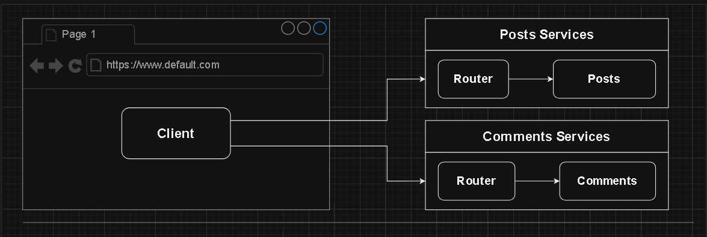
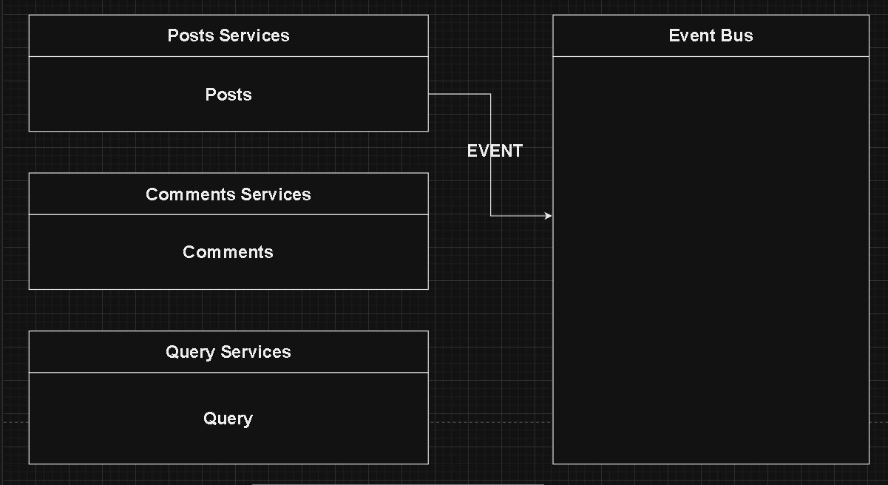
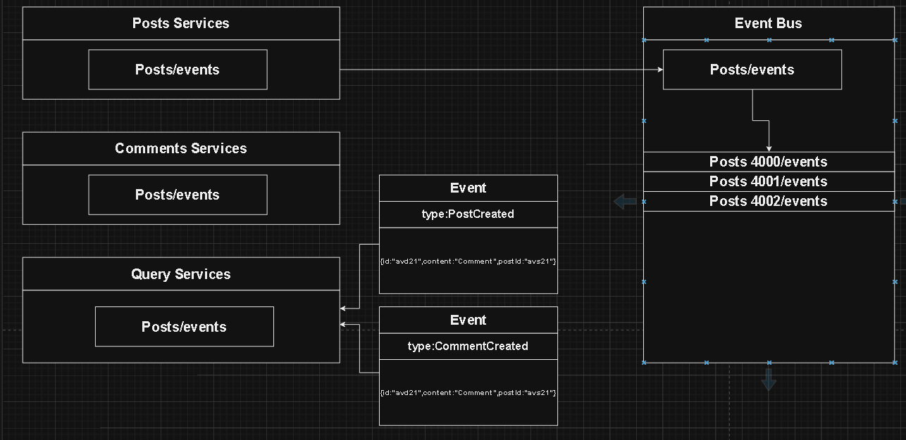
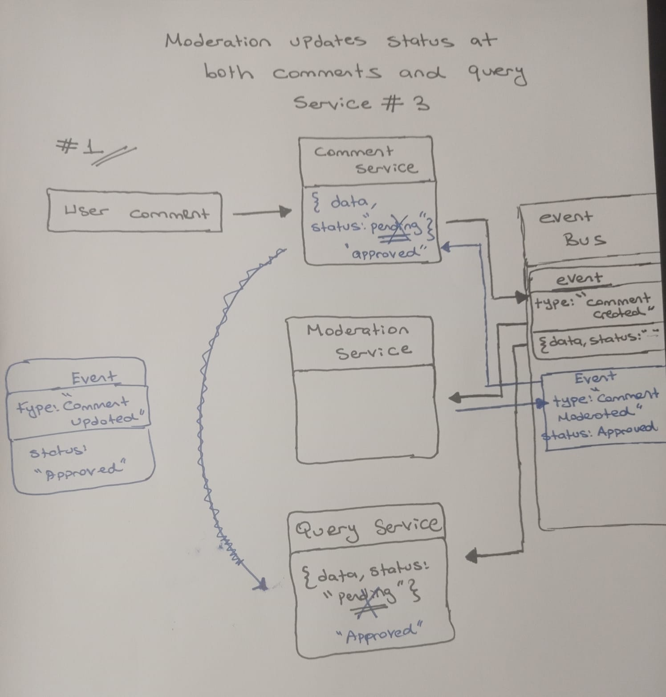

# Blog - Microservices Note

## Microservices Event Bus

In the context of microservices architecture, an _event bus_ is a communication system that facilitates the exchange of events (messages) between different microservices. Events represent occurrences or state changes within a microservice, and the event bus allows these events to be broadcasted to other microservices that might be interested in them.

### How it Works:

1. **Event Producer:** A microservice generates an event when a specific action or state change occurs within its domain. For example, a blog microservice might produce an event when a new blog is added.

2. **Event Bus:** The event bus is a messaging system that acts as a central channel for events. It allows microservices to publish (send) events to the bus and subscribe (receive) to events they are interested in.

3. **Event Consumer:** Other microservices, known as event consumers, can subscribe to specific types of events on the bus. When an event is published to the bus, all subscribed microservices receive a copy of the event and can take appropriate actions based on it. For instance, a billing microservice might subscribe to the "new blog added" event to update its records.

The event bus provides a decoupled way for microservices to communicate. Microservices don't need to be aware of each other's internal details; they only need to understand the structure of the events they are interested in. This decoupling enhances the flexibility, scalability, and maintainability of a microservices architecture.

Event-driven communication through an event bus is especially beneficial in scenarios where microservices need to be loosely coupled, allowing for independent development, deployment, and scaling of individual services.

